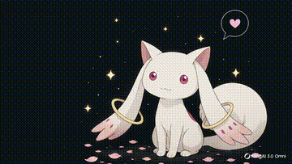

<table>
<tr>
<td width="60%" valign="top">

──────────────────────────────────────
I'm Sirah, 
a computer science student   
who enjoys learning how things work.
 

` learning  •  coding  •  creating `
 

✿ building projects, solving problems,  
&nbsp;&nbsp;&nbsp;and trying to be a little better every day.

✿ currently learning something new...

☕ coffee &nbsp;&nbsp; ♫ lofi &nbsp;&nbsp; 🌱 nature &nbsp;&nbsp; 📖 books &nbsp;&nbsp; ☾ night
──────────────────────────────────────
 
♡ thanks for visiting ♡ 

</td>

<td width="40%" align="center" valign="middle">

</td>
</tr>
</table>
